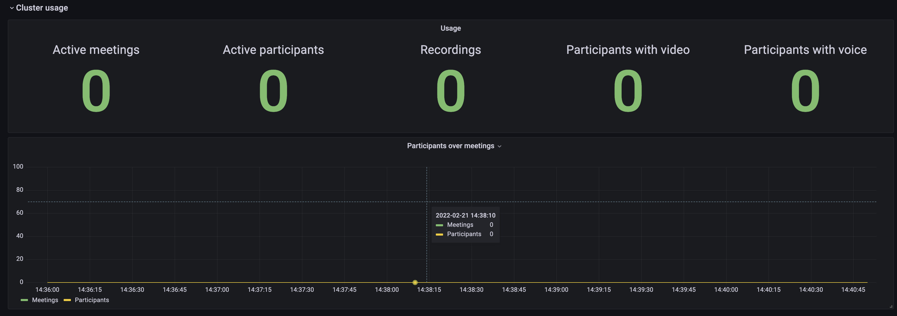

# B3LB cluster monitoring dashboard

Monitor your [B3LB](https://github.com/SLedunois/b3lb) cluster in real time using grafana. Monitor all your cluster or filter on a spcific instance.

Functional metrics:
- active meetings stat;
- active users stat;
- recording currently stored stat;
- active users over active meetings graph;

Technical metrics:
- CPU average over participants;
- Memory average over participants;
- Bandwidth over participants;

# Installation
## Grafana
Check official [Grafana installation documentation](https://grafana.com/docs/grafana/latest/).

## Dashboard
Get [dashboard json model](https://github.com/SLedunois/b3lb-cluster-monitoring/blob/main/grafana/B3LB%20cluster%20monitoring.json).

Go to `Dashboards` > `Browse` > `Import` and copy paste b3lb dashboard json model.

Select your input InfluxDB source.